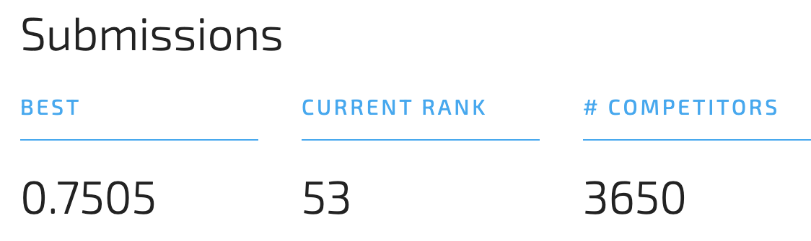

This project aims at a pipeline that works well in any classification problem. The goal is a non-data-scientist can use this pipeline to produce >=99% result of best-tuned model.

Have tried:
- Catboost
- Pycaret + MLflow
  
Nepal Earthquake Damage Grade(drivendata.org/competitions/57/nepal-earthquake/)
  